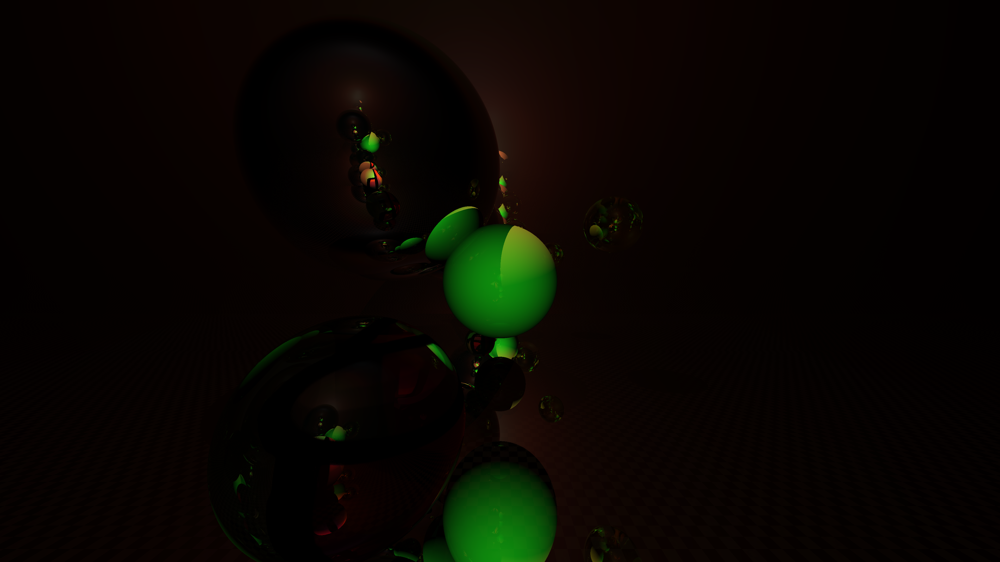

# ogronman-task-13


### Build & Run

In the main-directory:

##### Linux

```bash
./run.sh
```

if it does not work just run it again...

should probably work then for some reason

##### Windows 10


```bash
./run.ps1
```

##### Other operating systems

```bash
no
```

#### Example picture





